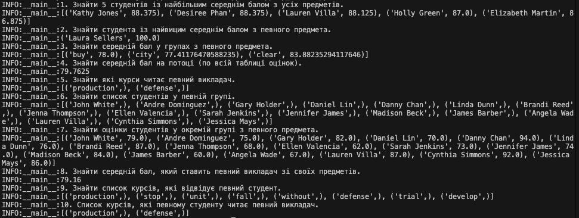

# goit-pythonweb-hw-02

1. Запустити контейнер з postgres:

```
docker build -t hw6-postgres .
docker run --name postgres-hw6 -p 5432:5432 -d hw6-postgres
```

2. Інсталювати залежності

```
poetry install
```

3. Перейти в середовище командного рядка poerty

```
poetry shell
```

4. Ініціалізуєвати Alembic

```
alembic init migrations

```

5. Ініціалізувати першу міграцію

```
alembic revision --autogenerate -m 'Init'

```

6. Застосувати міграцію

```
alembic upgrade head

```

7. Наповнити базу

```
python app/seed.py
```

8. Виконати запити

```
python app/my_select.py
```


